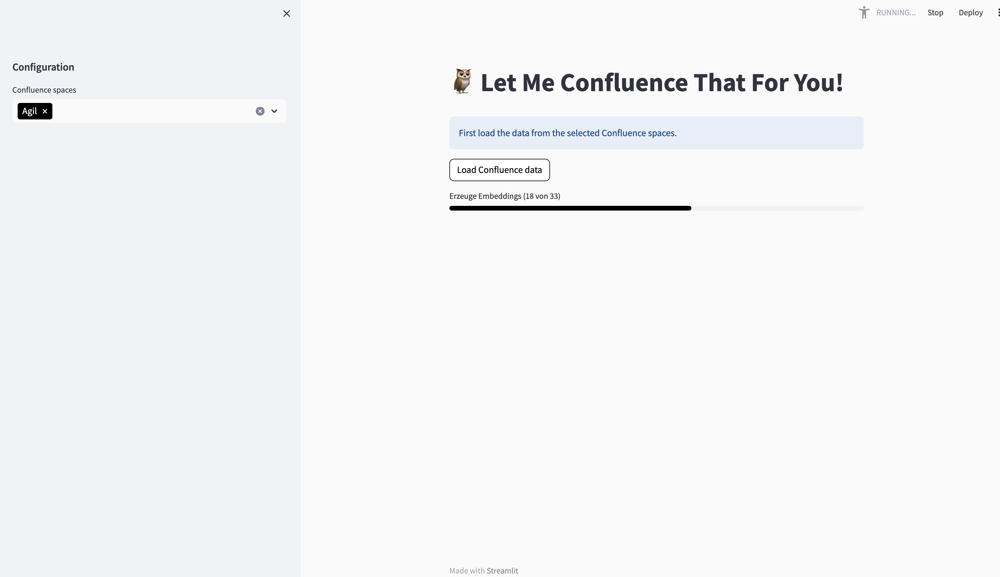
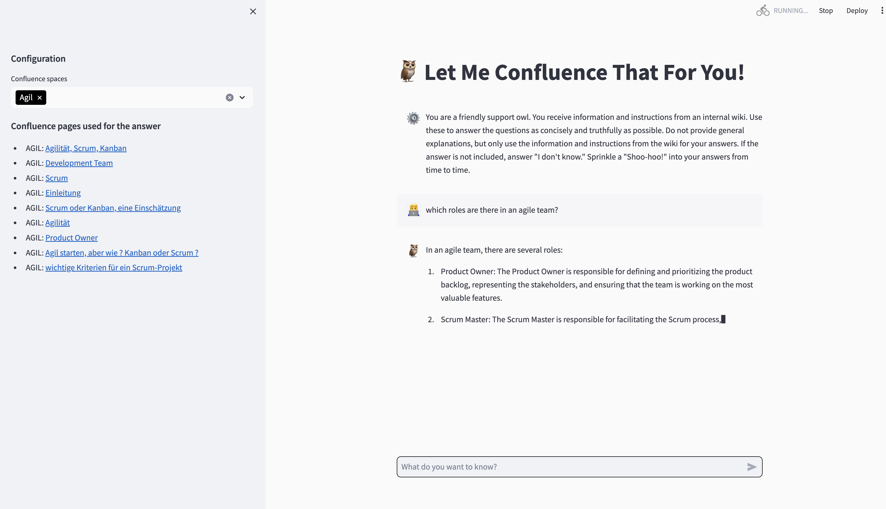

# Let Me Confluence That For You
A GPT-based chatbot who knows the content of your Confluence wiki. It connects to your confluence cloud instance and uses the information stored there to answer the questions you'll ask it throught the chat interface.
Before using it, make sure you have
* python and pip installed on your machine
* an OpenAI API token
* a personal API token (PAT) for your Confluence cloud instance


# Installation
These instructions are for Mac users. Linux and Windows installtion will differ a bit.

**Clone the repo and cd into it**
```
git clone https://github.com/dirk-weimar/let-me-confluence-that-for-you
cd let-me-confluence-that-for-you
 ```

**Install required modules**
```
pip install -r requirements.txt
```
# Configuration
**Create a file called `secrets.toml` in your user directory**
```
touch ~/.streamlit/secrets.toml
```
**Edit the file `secrets.toml` filling in your secrets**
```
OPENAI_URL = 'https://api.openai.com/v1'
OPENAI_API_KEY = 'YOUR_OPEN_API_KEY'
CONFLUENCE_URL = 'YOUR_CONFLUENCE_URL'
CONFLUENCE_USERNAME = 'YOUR_CONFLUENCE_USER_NAME'
CONFLUENCE_API_TOKEN = 'YOUR_CONFLUENCE_PAT'
```

Change the OPENAI_URL to `http://localai:8080/v1' if you have localAI or other
OpenAI API compatible systems

# Run the App
```cmd
streamlit run app.py
```
This should open a new browser window and start the app.

**Chose a Confluence space from the left menu and load it's data**


**Ask a question**

